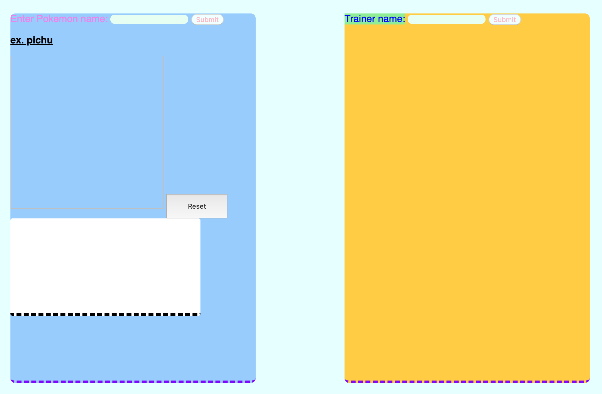

# Pokemon Seach Engine 

#### Link: 

https://mit945.github.io/Pokemon_Seach_Engine/poke_dex/ 

## Application Features
    
  * Type pokemon name in search box on the left color in **blue** to get character informations.
  * Type in user name on the right color in **yellow** to input player/trainer name
  * Drag image across page with Jquery UI
  * Have Fun!



## Tasks

  - [x] Create HTML template 
  - [x] Pull from PokeAPI 
  - [x] Destructure data strucutures from JSON template 
  - [x] Create CSS template
  - [x] Embed Jquery and UI tools
  - [x] Deploy on Github Pages
  - [x] Create Drag boxes for Pokemon Objects 

## Fetch API data 
  
  * Make AJAX calls to [PokeAPI](https://pokeapi.co/)

```javascript
	$.ajax({
		url : nameURL + pokemonName,
		dataType : 'json',
		method: 'GET'
	

	}).then((pokemonData) => {
		
		console.log(pokemonData)
	
	}),(error) => {
		console.log(error)
		console.log(nameURL)

		}
```
## License

Copyright (c) 2019 I-han Chang


